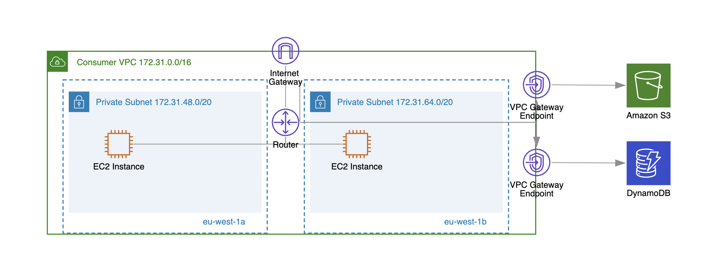
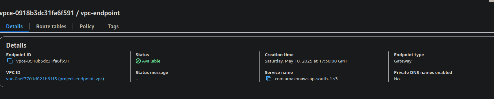
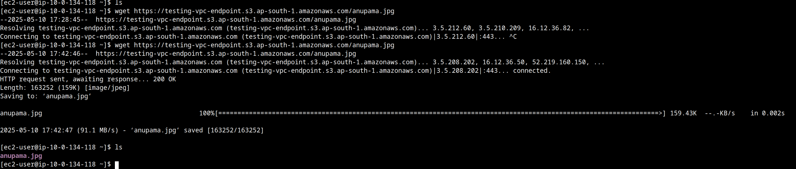
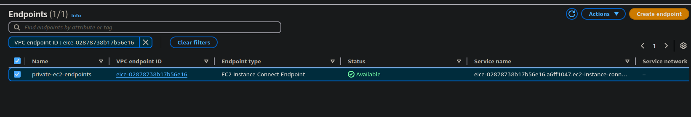

# VPC ENDPOINT
VPC ENDPOINT offer a highly secure and efficient method for connecting our aws resources to specific aws services, ensuring our data remains within the aws netowrk and not go thorugh the public network.

- with vpc endpoints, instance inside a private subnet of a vpc can communicate with aws services without needing a NAT device, VPN connection or aws direct connect

- enhanced security, improved performance, simplified network architecture, cost optimization
- there are two types of endpoint 'INTERFACE ENDPOINTS' and 'GATEWAY ENDPOINTS'

# INTERFACE ENDPOINTS
- Interface Endpoints are powered by AWS PrivateLink 
- interface endpoint creates an elastic network interface (ENI) with a private IP address in our subnets
- works with most of aws services (s3, dynamodb, kms, cloudwatch, ssm, api gateway, etc)
- aws modifies DNS resolution for the sercvice 
- charges based on hourly usage and data transfer costs

# GATEWAY ENDPOINTS
- no ENI or proivate IP is used
- it modifies our VPC route tables to direct traffic to aws services
- only works with amazon S3 and dynamoDB
- no hourly or data transfer costs
- works accross all subnets in a vpc

## HANDS-ON
- our goal is to access an s3 bucket from a private instance with no NAT using wget
- crete a s3 bucket with public access and upload a img or something in it
- make sure your bucket wont give any 403 error

- now create a vpc with public and private subnet
- create a ec2 in public subnet which we will use to ssh into another ec2 created in private subnet
- if we try to `wget https://testing-vpc-endpoint.s3.ap-south-1.amazonaws.com/anupama.jpg` from private ec2, it will simply timeout
- go to vpc -> endpoint -> create an end point for AWS SERVICE, this vpc and private subnet route table
- after the endpoitn is created we can try wget again to our img and it will be downloaded

# EC2 ENDPOINTS
- normally to access a private ec2, we need a jump server or bastion host
- ec2 endpoints allow us to ssh into them without any jump server using the ec2 endpoints
- go to vpc -> endpoints -> create ec2 endpoint
- choose your vpc,subnet, route and after it is active
- go to instance -> connect and choose ec2 endpoint connect and we can ssh directly into our private ec2

